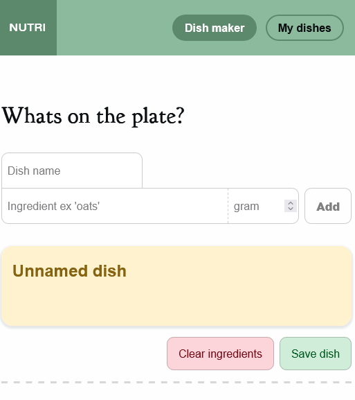
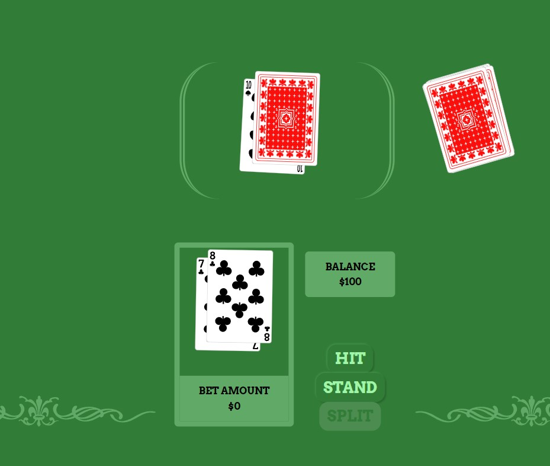
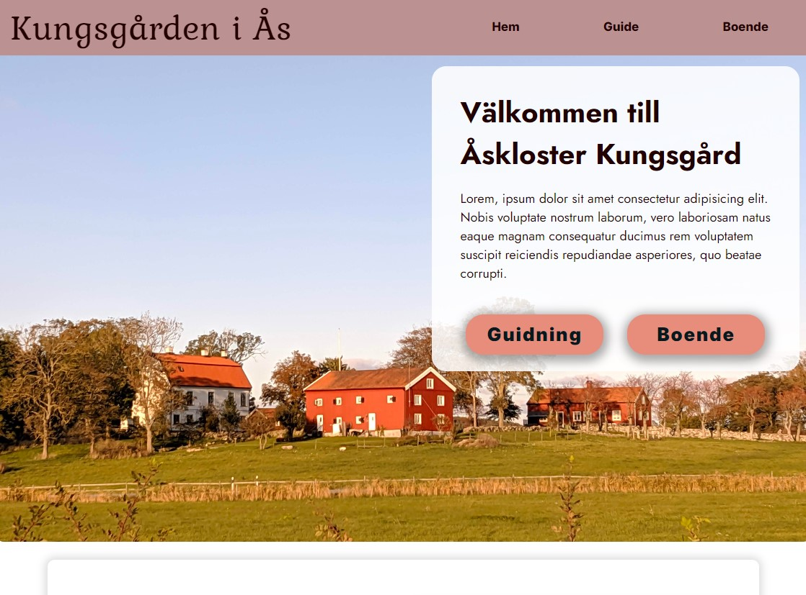

# Caspar
**Glad I found you!**

I spend my spare time crafting side projects I can enjoy and have a good time with. I thrive on building modular-based solutions with friends as a team. And when the code starts gnawing on my brain uncontrollably, I take a break, brew a cup of soothing tea, and enjoy a digital sparkling campfire.

---

 
 
 
 
 
 
 
 

# My recent work

**Below is a collection of projects Im most proud of, sit back grab a drink and enjoy the scroll**

## Portion nutrition calculator

After learning native javascript i composed a site where you enter the ingredients and get the total componed portions nutritional values. In "My Dishes" you can find graphs over daily recommended intake for each nutrition your dish provides.

[Link: Nutri website](https://caprpar.github.io/native-javascript/del2/labb-2/index.html)
 

[Link: Project repo](https://github.com/Caprpar/native-javascript/tree/publish/del2/labb-2)

 
 
 
 
 
 
 
 
 
 

## Blackjack

While getting understimulated during native JS classes I started coding a black jack game i could occupy myself with. The player starts with 100 coins, can bet and choose to hit or stand during play

[Link: Blackjack website](https://caprpar.github.io/black-jack/)
 

[Link: Project repo](https://github.com/Caprpar/black-jack)

 
 
 
 
 
 
 
 
 
 

## Kungsgården

First time building a "whole" website using plain html and css, this project blew me away of what I was able to create after just 3 weeks of introduction. This is a page for the familys organisation, where you can book guides and accommodations.

[Link: Kungsgården website](https://caprpar.github.io/kungsgarden/)
 

[Link: Project repo](https://github.com/Caprpar/kungsgarden)

 
 
 
 
 
 
 
 
 
 

<!--
**Caprpar/caprpar** is a ✨ _special_ ✨ repository because its `README.md` (this file) appears on your GitHub profile.
- 🔭 I’m currently working on
- 🌱 I’m currently learning ...
- 👯 I’m looking to collaborate on ...
- 🤔 I’m looking for help with ...
- 💬 Ask me about ...
- 📫 How to reach me: ...
- 😄 Pronouns: ...
- ⚡ Fun fact: ...

Here are some ideas to get you started:

-->
