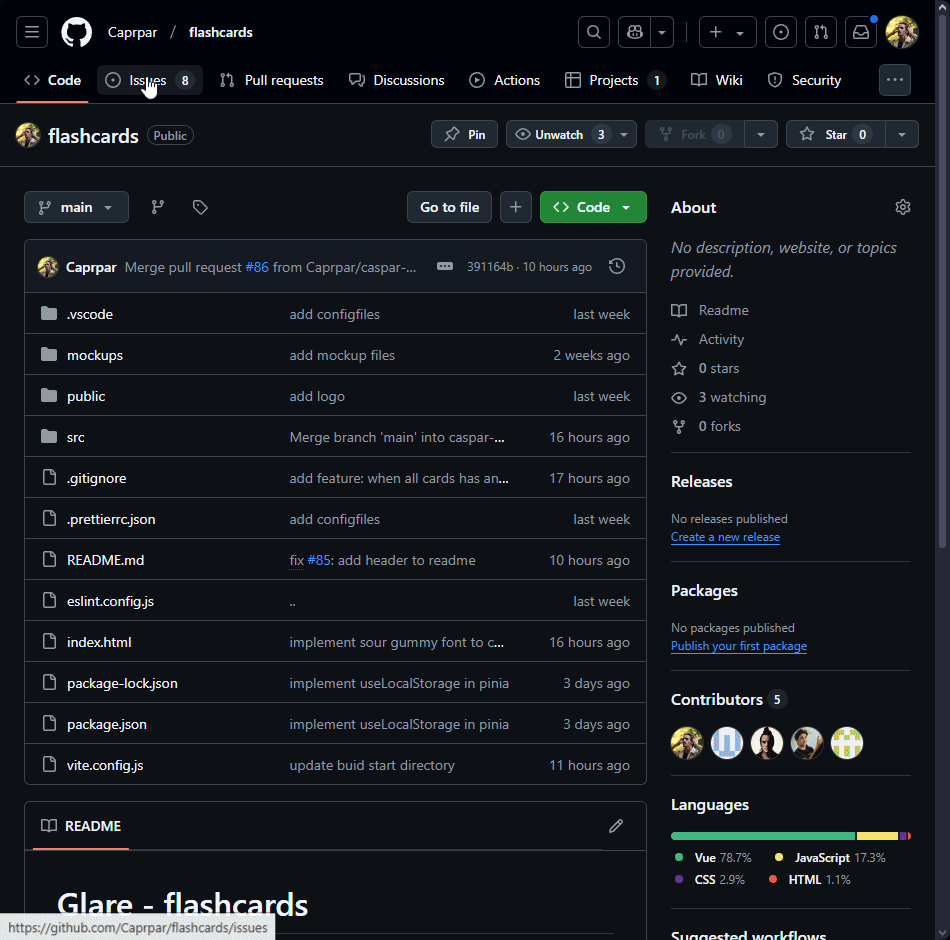
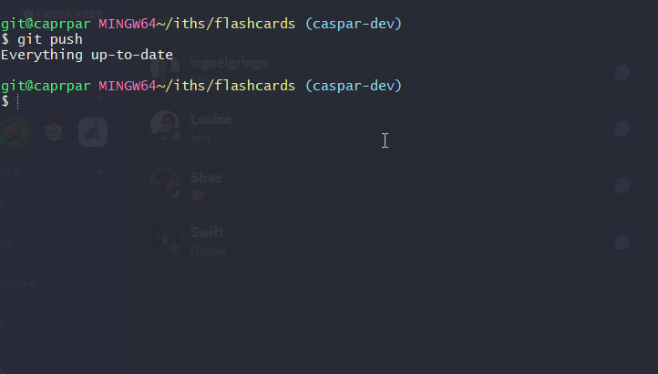
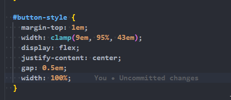
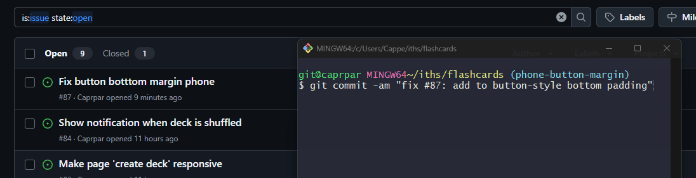
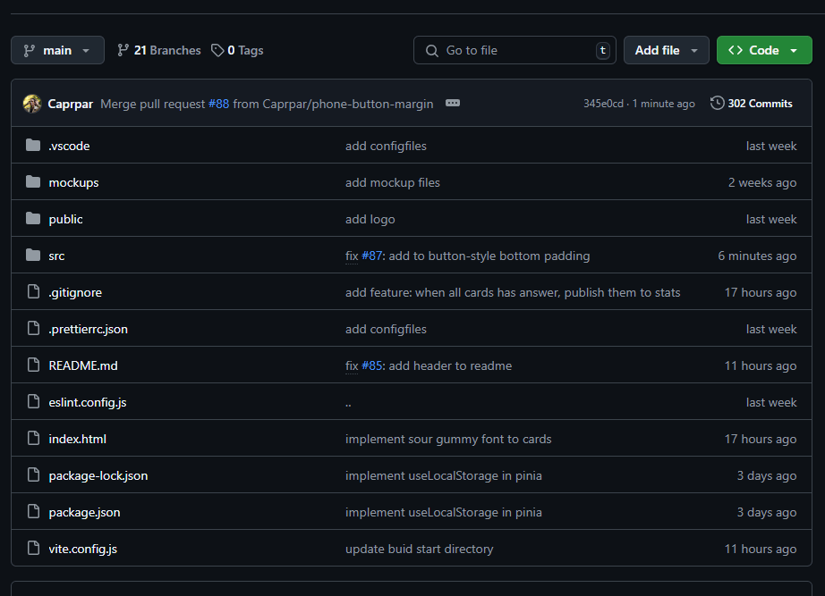
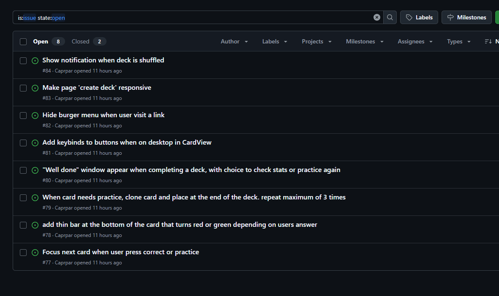

## Skapa issue



## Skapa gren med beskrivande namn



## Gör fixa issue i projektet



## Använd issuenummret i commiten tillsammans med "fix/closed/feature" #87: Meddelande

```git
$ git commit -am "fix #87: add button style bottom"
$ git push --set-upstream origin phone-button-margin
```



## Gör pull merge i github


## Github känner igen issue taggen när du committar



## Nur har issuen gått från "open" till "closed"



# Standup 04-03/25

## Caspar

- Modifiera sättet pinia tar fram bästa och sämta kort

## Zaher

## Simon

- Ge användare feedback när en session är avklarad

## Elin

- Fixa hamburgarmeny buggar
- Navigera till nästa kort vid correct / practice

## Ingo

- Fixa navigerin mellan kort med pilarna
- Lägga till en liten border i botten på aktuella kort för att indikera om man svarat rätt eller fel på just det kortet
